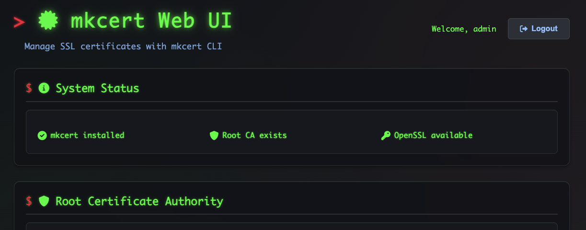

# mkcert Web UI

A secure, modern web interface for managing SSL certificates using the mkcert CLI tool. Generate, download, and manage local development certificates with enterprise-grade security and an intuitive web interface.

## ✨ Key Features

- **🔐 Certificate Generation**: Create certificates for multiple domains and IP addresses
- **📡 SCEP Service**: Simple Certificate Enrollment Protocol for automatic device enrollment
- **🛡️ Enterprise Security**: Command injection protection, path traversal prevention, and comprehensive rate limiting
- **📋 Multiple Formats**: Generate PEM, CRT, and PFX (PKCS#12) certificates
- **🔒 Flexible Authentication**: Basic auth and OpenID Connect SSO support
- **📧 Email Notifications**: Automated SMTP alerts for expiring certificates
- **📊 Certificate Monitoring**: Automatic monitoring with configurable warning periods
- **🎨 Modern UI**: Dark/light themes with responsive design
- **🐳 Docker Ready**: Complete containerization with docker-compose

## 📷 Screenshots



*Modern web interface showing certificate generation and management features*

## 🚀 Quick Start

## Docker Hub
[https://hub.docker.com/r/jeffcaldwellca/mkcertweb](https://hub.docker.com/r/jeffcaldwellca/mkcertweb)

### Using Docker (Recommended)

```bash
# Clone and start
git clone https://github.com/jeffcaldwellca/mkcertWeb.git
cd mkcertWeb
docker-compose up -d

# Access at http://localhost:3000
```

### Local Installation

```bash
# Prerequisites: Node.js 16+, mkcert, OpenSSL
npm install
mkcert -install    # First time only
npm start
```

**For detailed setup instructions, see [DOCKER.md](DOCKER.md)**

## ⚙️ Configuration

### Environment Variables

```bash
# Server
PORT=3000
ENABLE_HTTPS=true
HTTPS_PORT=3443

# Authentication
ENABLE_AUTH=true
AUTH_USERNAME=admin
AUTH_PASSWORD=your-password
SESSION_SECRET=your-random-secret

# OpenID Connect (Optional)
ENABLE_OIDC=false
OIDC_ISSUER=https://your-provider.com
OIDC_CLIENT_ID=your-client-id
OIDC_CLIENT_SECRET=your-secret

# Email Notifications
EMAIL_NOTIFICATIONS_ENABLED=true
SMTP_HOST=smtp.gmail.com
SMTP_PORT=587
SMTP_SECURE=false
SMTP_USER=your-email@domain.com
SMTP_PASSWORD=your-app-password
EMAIL_FROM=mkcert@yourcompany.com
EMAIL_TO=admin@company.com,ops@company.com

# Certificate Monitoring
CERT_MONITORING_ENABLED=true
CERT_CHECK_INTERVAL=0 8 * * *    # Daily at 8 AM
CERT_WARNING_DAYS=30
CERT_CRITICAL_DAYS=7
```

**Common SMTP Providers:**
- Gmail: `smtp.gmail.com:587` (use App Password)
- Outlook: `smtp-mail.outlook.com:587`
- Exchange: `mail.yourcompany.com:587`

See `.env.example` for all configuration options.

## 📚 Usage

1. Access `http://localhost:3000`
2. Login with configured credentials (default: admin/admin)
3. Enter domains (one per line) and select format
4. Download certificates in PEM, CRT, or PFX format
5. Manage certificates: view, archive, or restore

## 📡 SCEP Service

Built-in SCEP (Simple Certificate Enrollment Protocol) server for automatic certificate enrollment on iOS, macOS, Windows, and other SCEP-compatible devices.

- **Automatic Enrollment**: Devices can automatically request certificates
- **Challenge Authentication**: Secure enrollment with time-limited challenge passwords
- **Standard Compliance**: Implements GetCACert and GetCACaps operations
- **Web Management**: `/scep.html` interface for managing SCEP operations

**For detailed SCEP configuration, see [SCEP.md](SCEP.md)**

## 🔒 Security Features

### Enterprise-Grade Protection
- **Command Injection Protection**: Strict allowlist-based command validation
- **Path Traversal Prevention**: Comprehensive file access validation
- **Input Sanitization**: All user inputs validated and sanitized
- **Filename Validation**: Prevents malicious filename patterns and null byte attacks

### Multi-Tier Rate Limiting
- CLI Operations: 10 per 15 minutes
- API Requests: 100 per 15 minutes  
- Authentication: 5 attempts per 15 minutes
- General Access: 200 requests per 15 minutes

## 🔗 API Reference

| Method | Endpoint | Description |
|--------|----------|-------------|
| `GET` | `/api/status` | System status and mkcert installation |
| `POST` | `/api/generate` | Generate new certificates |
| `GET` | `/api/certificates` | List all certificates |
| `GET` | `/download/:filename` | Download certificate files |
| `GET` | `/api/email/status` | Email configuration status |
| `POST` | `/api/email/test` | Send test email |
| `GET` | `/api/monitoring/status` | Certificate monitoring status |
| `GET` | `/api/monitoring/expiring` | List expiring certificates |

**Example:**
```bash
curl -X POST http://localhost:3000/api/generate \
  -H "Content-Type: application/json" \
  -d '{"domains":["localhost","127.0.0.1"],"format":"pem"}'
```

## 📁 Project Structure

```
mkcertWeb/
├── server.js                 # Main application entry point
├── src/
│   ├── config/              # Configuration management
│   ├── security/            # Security utilities
│   ├── middleware/          # Express middleware
│   ├── routes/              # Route handlers
│   ├── services/            # Email and monitoring services
│   └── utils/               # Utility functions
├── public/                  # Frontend static assets
├── certificates/            # Certificate storage
└── .env.example            # Environment configuration template
```

## 🔧 Certificate Management

- **View Details**: Domain coverage, expiry dates, file sizes
- **Download**: Individual files, ZIP bundles, or PFX format  
- **PFX Generation**: Create password-protected PKCS#12 files on-demand
- **Delete**: Remove certificates (root certificates are protected)
- **System Status**: View Root CA information and installation status

### Local Development
```bash
# Clone and setup
git clone https://github.com/jeffcaldwellca/mkcertWeb.git
cd mkcertWeb
npm install
mkcert -install    # First time only

# Development modes
npm start          # HTTP only
npm run dev        # HTTP with auto-restart
npm run https-dev  # HTTPS with auto-restart
```

### Authentication Setup

```bash
# Copy example configuration
cp .env.example .env

# Edit .env file
ENABLE_AUTH=true
AUTH_USERNAME=your-username
AUTH_PASSWORD=your-secure-password
SESSION_SECRET=your-very-long-random-secret-key
```

**Note**: Always use a strong `SESSION_SECRET` in production and enable HTTPS when authentication is enabled.

## 🐛 Troubleshooting

| Issue | Solution |
|-------|----------|
| mkcert not found | `which mkcert && mkcert -version` |
| Permission denied | `sudo chown -R $(whoami):$(whoami) certificates/` |
| Port already in use | `PORT=3001 npm start` |
| CA installation issues | `mkcert -install && ls -la $(mkcert -CAROOT)` |
| Browser trust issues | Clear cache, restart browser after CA installation |

## 🤝 Contributing

1. Fork the repository
2. Create a feature branch: `git checkout -b feature/new-feature`
3. Commit changes: `git commit -am 'Add new feature'`
4. Push to branch: `git push origin feature/new-feature`
5. Submit a pull request

## 📄 License

This project is licensed under the GPLv3 License - see the [LICENSE](LICENSE) file for details.

## 🙏 Acknowledgments

- [mkcert](https://github.com/FiloSottile/mkcert) - Simple tool for making locally-trusted development certificates
- [Express.js](https://expressjs.com/) - Web application framework
- [Node.js](https://nodejs.org/) - JavaScript runtime

## 📞 Support

- 🐛 **Issues**: [GitHub Issues](https://github.com/jeffcaldwellca/mkcertWeb/issues)
- 📖 **Documentation**: [README.md](README.md), [DOCKER.md](DOCKER.md), [SCEP.md](SCEP.md)
- 💬 **Discussions**: [GitHub Discussions](https://github.com/jeffcaldwellca/mkcertWeb/discussions)
