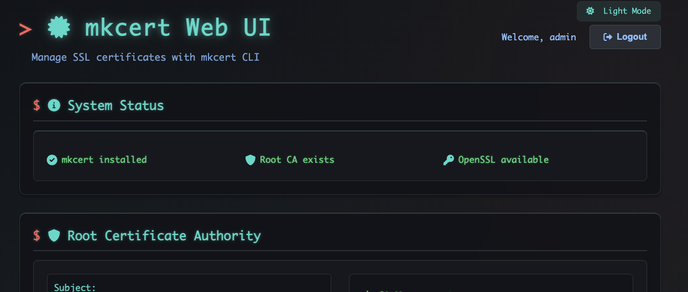

# mkcert Web UI

A modern web interface for managing SSL certificates using the mkcert CLI tool. Generate, download, and manage local development certificates with an intuitive web interface featuring Docker support, PFX generation, and comprehensive certificate management.

## ✨ Features

- **🔐 Certificate Generation**: Create SSL certificates for multiple domains and IP addresses
- **📋 Multiple Formats**: Generate PEM, CRT, and PFX (PKCS#12) certificates on-demand
- **🔒 Flexible Authentication**: Basic authentication and enterprise SSO with OpenID Connect (OIDC)
- **🏢 Enterprise SSO**: OpenID Connect integration for Azure AD, Google, and other OIDC providers
- **🌐 HTTPS Support**: Auto-generated SSL certificates for secure web interface
- **📋 Certificate Management**: View, download, archive, and restore certificates
- **🎨 Modern UI**: Dark/light themes with responsive design and mobile support
- **🐳 Docker Support**: Complete containerization with docker-compose deployment
- **🔑 Root CA Management**: Install, view, and download the mkcert Certificate Authority
- **📊 Certificate Details**: Comprehensive information including expiry tracking
- **🔄 Automatic Organization**: Timestamp-based folder structure for easy management

## 🚀 Quick Start with Docker

The fastest way to get started is using Docker:

```bash
# Clone the repository
git clone https://github.com/jeffcaldwellca/mkcertWeb.git
cd mkcertWeb

# Start with Docker Compose (includes automatic CA generation)
docker-compose up -d

# Access the application
open http://localhost:3000
```

**For detailed Docker setup, configuration, and deployment options, see [DOCKER.md](DOCKER.md)**

For local installation without Docker, you'll need Node.js 16+, mkcert, and OpenSSL. See [Installation Guide](#-installation) below for detailed setup instructions.

## 📸 Screenshot



*The mkcert Web UI featuring the modern terminal-style theme with certificate management, system status, and Root CA information.*

## 🔧 Installation

### Method 1: Docker (Recommended)

See the [Quick Start with Docker](#-quick-start-with-docker) section above, or [DOCKER.md](DOCKER.md) for comprehensive Docker deployment options.

### Method 2: Local Installation

#### Prerequisites
- **Node.js** (version 16 or higher)
- **mkcert** CLI tool  
- **OpenSSL** (usually pre-installed on most systems)

#### Ubuntu/Debian Setup
```bash
# Install Node.js
sudo apt update
sudo apt install -y nodejs npm

# Install mkcert dependencies and download mkcert
sudo apt install -y libnss3-tools wget
wget -O mkcert https://github.com/FiloSottile/mkcert/releases/latest/download/mkcert-v1.4.4-linux-amd64
chmod +x mkcert
sudo mv mkcert /usr/local/bin/

# Verify installations
node --version  # Should be v16+
mkcert -version
openssl version
```

#### Application Setup
```bash
# Clone and install
git clone https://github.com/jeffcaldwellca/mkcertWeb.git
cd mkcertWeb
npm install

# Initialize mkcert (first time only)
mkcert -install

# Start the application
npm start

# Access at http://localhost:3000
```

## ⚙️ Configuration

### Environment Variables

Configure the application using a `.env` file (see `.env.example`) or environment variables:

```bash
# Authentication Configuration
ENABLE_AUTH=true             # Enable user authentication (default: true)
USERNAME=admin               # Username for basic authentication  
PASSWORD=admin123            # Password for basic authentication

# OpenID Connect (OIDC) SSO Authentication
ENABLE_OIDC=false            # Enable OIDC SSO authentication (default: false)
OIDC_ISSUER=                 # OIDC provider issuer URL
OIDC_CLIENT_ID=              # OIDC client application ID
OIDC_CLIENT_SECRET=          # OIDC client secret
OIDC_CALLBACK_URL=           # OIDC callback URL (auto-configured)
OIDC_SCOPE=openid profile email  # OIDC scopes to request

# Server Configuration
PORT=3000                    # HTTP server port
ENABLE_HTTPS=true            # Enable HTTPS server
HTTPS_PORT=3443              # HTTPS server port
SSL_DOMAIN=localhost         # Domain for SSL certificate
FORCE_HTTPS=true             # Redirect HTTP to HTTPS

# Certificate Settings
CERTIFICATE_FORMAT=pem       # Default format: 'pem' or 'crt'
```

### Authentication Setup

The application supports two authentication methods that can be used together or independently:

#### Basic Authentication (Default)
```bash
ENABLE_AUTH=true
USERNAME=admin
PASSWORD=your-secure-password
```

#### Enterprise SSO with OpenID Connect
```bash
# Enable OIDC alongside basic auth
ENABLE_OIDC=true
OIDC_ISSUER=https://login.microsoftonline.com/your-tenant-id/v2.0
OIDC_CLIENT_ID=your-azure-app-id
OIDC_CLIENT_SECRET=your-client-secret
```

**Supported OIDC Providers:**
- Microsoft Azure AD / Entra ID
- Google Workspace
- Okta
- Auth0
- Any OpenID Connect compliant provider

For detailed OIDC setup instructions, see the `.env.example` file.

### HTTPS Setup

The application supports automatic HTTPS with mkcert-generated certificates:

```bash
# HTTPS with HTTP fallback (recommended for development)
npm run https

# HTTPS only (redirects HTTP to HTTPS)
npm run https-only

# Custom domain
SSL_DOMAIN=myapp.local ENABLE_HTTPS=true npm start
```

SSL certificates are automatically generated and stored in the `./ssl/` directory. Since they're created with mkcert, they're automatically trusted by your browser.

### Production Deployment

For production deployments, consider using Docker or see [DOCKER.md](DOCKER.md) for comprehensive deployment options including reverse proxy configurations and security best practices.

## 📚 Usage

### First Time Setup

1. **System Check**: The web interface automatically verifies mkcert and OpenSSL installation
2. **Root CA Installation**: Install the mkcert root CA if prompted (`mkcert -install`)
3. **Authentication**: Choose your authentication method:
   - **Basic Auth**: Log in with configured credentials (default: admin/admin123)
   - **OIDC SSO**: Use your organization's single sign-on when OIDC is configured

### 🔐 Certificate Generation

1. **Access Interface**: Navigate to `http://localhost:3000`
2. **Enter Domains**: Add domain names (one per line):
   ```
   localhost
   127.0.0.1
   *.example.com
   example.com
   myapp.local
   ```
3. **Select Format**: Choose PEM (.pem/.key) or CRT (.crt/.key) format
4. **Generate**: Click "Generate Certificate"

### 📁 Certificate Organization

Certificates are automatically organized with timestamps:
```
certificates/
├── root/                           # Legacy certificates (protected)
└── 2025-01-20/                     # Date-based organization
    ├── 2025-01-20T10-30-45_localhost/
    │   ├── localhost.pem
    │   ├── localhost-key.pem
    │   └── localhost.pfx           # Generated on-demand
    └── 2025-01-20T14-15-20_example/
        ├── example.crt
        └── example.key
```

### 🔧 Certificate Management

- **📋 View Details**: Domain coverage, expiry dates, file sizes
- **⬇️ Download**: Individual files, ZIP bundles, or PFX format  
- **🔑 PFX Generation**: Create password-protected PKCS#12 files on-demand
- **🗑️ Delete**: Remove certificates (root certificates are protected)
- **📊 System Status**: View Root CA information and installation status

### 🌐 Advanced Usage

For production deployments, reverse proxy configurations, and advanced Docker setups, see [DOCKER.md](DOCKER.md).

## 🔗 API Reference

The application provides REST API endpoints for programmatic access. When authentication is enabled, establish a session first via `POST /login`.

### Key Endpoints

| Method | Endpoint | Description |
|--------|----------|-------------|
| `GET` | `/api/status` | System status and mkcert installation |
| `POST` | `/api/generate` | Generate new certificates |
| `GET` | `/api/certificates` | List all certificates |
| `GET` | `/api/download/bundle/:folder/:certname` | Download certificate bundle |
| `POST` | `/api/generate/pfx/*` | Generate PFX file on-demand |

Example certificate generation:
```bash
# Generate certificate via API
curl -X POST http://localhost:3000/api/generate \
  -H "Content-Type: application/json" \
  -d '{"domains":["localhost","127.0.0.1"],"format":"pem"}'
```

## 🤝 Contributing

1. Fork the repository
2. Create a feature branch: `git checkout -b feature/new-feature`
3. Commit changes: `git commit -am 'Add new feature'`
4. Push to branch: `git push origin feature/new-feature`
5. Submit a pull request

## 📄 License

This project is licensed under the MIT License - see the [LICENSE](LICENSE) file for details.

## 🙏 Acknowledgments

- [mkcert](https://github.com/FiloSottile/mkcert) - Simple tool for making locally-trusted development certificates
- [Express.js](https://expressjs.com/) - Web application framework
- [Node.js](https://nodejs.org/) - JavaScript runtime

## 📞 Support

- 🐛 **Issues**: [GitHub Issues](https://github.com/jeffcaldwellca/mkcertWeb/issues)
- 📖 **Documentation**: [README.md](README.md) and [DOCKER.md](DOCKER.md)
- 💬 **Discussions**: [GitHub Discussions](https://github.com/jeffcaldwellca/mkcertWeb/discussions)
4. Push to branch: `git push origin feature/new-feature`
5. Submit a pull request

## 📄 License

This project is licensed under the MIT License - see the [LICENSE](LICENSE) file for details.

## 🙏 Acknowledgments

- [mkcert](https://github.com/FiloSottile/mkcert) - Simple tool for making locally-trusted development certificates
- [Express.js](https://expressjs.com/) - Web application framework
- [Node.js](https://nodejs.org/) - JavaScript runtime

## 📞 Support

- 🐛 **Issues**: [GitHub Issues](https://github.com/jeffcaldwellca/mkcertWeb/issues)
- 📖 **Documentation**: [README.md](README.md) and [DOCKER.md](DOCKER.md)
- 💬 **Discussions**: [GitHub Discussions](https://github.com/jeffcaldwellca/mkcertWeb/discussions)
wget --post-data='{"domains":["localhost","127.0.0.1","*.local.dev"],"format":"pem"}' \
     --header='Content-Type: application/json' \
     http://localhost:3000/api/generate \
     -O /tmp/cert-response.json

# Generate CRT format certificate
wget --post-data='{"domains":["example.local","api.example.local"],"format":"crt"}' \
     --header='Content-Type: application/json' \
     http://localhost:3000/api/generate \
     -O /tmp/cert-response.json
```

#### Download Certificate Bundle
```bash
# Download as bundle (no external tools needed)
wget http://localhost:3000/api/download/bundle/2025-07-25_2025-07-25T10-30-45_localhost/localhost_127-0-0-1 \
     -O certificate-bundle.zip
```

#### Check System Status
```bash
# Check if mkcert is installed and CA exists
wget -qO- http://localhost:3000/api/status | python3 -m json.tool
```

#### List All Certificates
```bash
# Get certificate inventory
wget -qO- http://localhost:3000/api/certificates | python3 -m json.tool
```

## File Structure

```
mkcertWeb/
├── server.js                 # Express server and API routes
├── package.json             # Node.js dependencies and scripts  
├── public/                  # Frontend static assets
│   ├── index.html          # Main web interface
│   ├── login.html          # Authentication login page
│   ├── styles.css          # Terminal-style CSS with red/green theme
│   ├── script.js           # Frontend JavaScript functionality
│   └── assets/             # Static assets (screenshots, etc.)
├── certificates/            # Certificate storage (organized by date)
│   ├── root/               # Legacy certificates (read-only)
│   └── YYYY-MM-DD/         # Date-based organization
│       └── YYYY-MM-DDTHH-MM-SS_domains/  # Timestamped folders
├── .env.example            # Environment configuration template
├── README.md               # Comprehensive documentation
├── CHANGELOG.md            # Version history and release notes
├── TESTING.md              # Testing procedures and validation
└── package-lock.json       # Dependency lock file
```

## Security & Best Practices

## Security & Best Practices

### Security Model
- **Development Focus**: Designed for local development environments
- **Flexible Authentication**: Basic authentication and enterprise SSO with OpenID Connect
- **Enterprise SSO**: Secure OIDC integration with proper token validation and session management
- **Regular User Execution**: Runs without root privileges (except for `mkcert -install`)
- **Read-Only Protection**: Root directory certificates cannot be deleted
- **Session Security**: HTTP-only cookies with CSRF protection and secure OIDC flows
- **Organized Storage**: Timestamp-based folders prevent conflicts
- **Provider Security**: OIDC callback validation and secure provider configuration

### Network Security
- **HTTP Only**: Suitable for localhost development (consider HTTPS proxy for production)
- **Local Binding**: Binds to localhost by default (configurable)
- **No External Dependencies**: No outbound network calls required during operation

### File Permissions
```bash
# Recommended permissions for production deployment
find /opt/mkcertui -type f -name "*.pem" -exec chmod 600 {} \;  # Private keys
find /opt/mkcertui -type f -name "*.crt" -exec chmod 644 {} \;  # Certificates
find /opt/mkcertui -type d -exec chmod 755 {} \;               # Directories
```

## Development

### Local Development
```bash
# Clone and setup
git clone https://github.com/jeffcaldwellca/mkcertWeb.git
cd mkcertWeb
npm install

# Development modes
npm start                    # HTTP only (http://localhost:3000)
npm run https               # HTTP + HTTPS (http://localhost:3000 & https://localhost:3443)
npm run https-only          # HTTPS only with HTTP redirect (https://localhost:3443)
npm run dev                 # HTTP with auto-restart (nodemon)
npm run https-dev          # HTTPS with auto-restart (nodemon)

# Custom domain HTTPS
SSL_DOMAIN=myapp.local npm run https
```

### Testing
See `TESTING.md` for comprehensive testing procedures including:
- Installation verification
- Certificate generation testing
- Authentication testing (both basic and OIDC)
- API endpoint validation
- Security testing
- OIDC SSO integration testing
- Browser integration testing

## Configuration

### Environment Variables
```bash
# Server Configuration
PORT=3000                    # Server port (default: 3000)
HTTPS_PORT=3443             # HTTPS server port (default: 3443)
NODE_ENV=production          # Environment mode (development/production)
CERT_DIR=/custom/path        # Custom certificate storage directory

# HTTPS Configuration
ENABLE_HTTPS=true           # Enable HTTPS server (true/false)
SSL_DOMAIN=localhost        # Domain name for SSL certificate
FORCE_HTTPS=false           # Redirect HTTP to HTTPS (true/false)

# Authentication Configuration
ENABLE_AUTH=false           # Enable user authentication (true/false)
AUTH_USERNAME=admin         # Username for authentication (when ENABLE_AUTH=true)
AUTH_PASSWORD=admin         # Password for authentication (when ENABLE_AUTH=true)
SESSION_SECRET=your-secret  # Session secret key - CHANGE IN PRODUCTION!

# UI Configuration
DEFAULT_THEME=dark          # Default theme mode for new users (dark/light)
```

### Authentication Setup

To enable user authentication and secure access to the web interface:

1. **Copy the example configuration:**
   ```bash
   cp .env.example .env
   ```

2. **Enable authentication in `.env`:**
   ```bash
   ENABLE_AUTH=true
   AUTH_USERNAME=your-username
   AUTH_PASSWORD=your-secure-password
   SESSION_SECRET=your-very-long-random-secret-key
   ```

3. **Start the server:**
   ```bash
   npm start
   ```

4. **Access the application:**
   - Visit http://localhost:3000 (or your configured URL)
   - You'll be redirected to a login page
   - Enter your configured username and password

**Security Notes:**
- When `ENABLE_AUTH=false`, authentication is completely disabled and users have direct access
- When `ENABLE_AUTH=true`, all API routes are protected and require valid session authentication
- Always use a strong, unique `SESSION_SECRET` in production environments
- Consider using HTTPS when authentication is enabled for additional security

### Theme Configuration

The application supports both dark and light themes with a toggle button. You can set the default theme for new users:

```bash
# Set default theme in .env
DEFAULT_THEME=light  # Start with light mode for new users
DEFAULT_THEME=dark   # Start with dark mode for new users (default)
```

**Theme Behavior:**
- Users can toggle between themes using the button in the header
- Theme preference is saved in browser localStorage
- If no stored preference exists, the server's `DEFAULT_THEME` setting is used
- Supports both the main application and login page
- Available via API endpoint: `GET /api/config/theme`

### Customization
```bash
# Custom certificate storage location
export CERT_DIR=/var/lib/mkcertui/certificates
mkdir -p $CERT_DIR
chown mkcertui:mkcertui $CERT_DIR
```

## Troubleshooting

### Common Issues

#### mkcert not found
```bash
# Verify installation
which mkcert
mkcert -version

# Check PATH
echo $PATH
```

#### Permission Denied
```bash
# Check file permissions
ls -la certificates/
# Ensure proper ownership
sudo chown -R $(whoami):$(whoami) certificates/
```

#### Port Already in Use
```bash
# Check what's using port 3000
sudo netstat -tlnp | grep :3000
# Use different port
PORT=3001 npm start
```

#### CA Installation Issues
```bash
# Manual CA installation
mkcert -install
# Verify CA location
mkcert -CAROOT
# Check CA files exist
ls -la $(mkcert -CAROOT)
```

#### Browser Trust Issues
1. Clear browser cache and cookies
2. Restart browser after CA installation
3. Check browser certificate settings
4. Verify system certificate store

### Log Analysis
```bash
# Check application logs
journalctl -u mkcertui -f

# Check nginx logs (if using reverse proxy)
sudo tail -f /var/log/nginx/access.log
sudo tail -f /var/log/nginx/error.log
```

## Contributing

### Development Setup
1. Fork the repository
2. Create a feature branch: `git checkout -b feature-name`
3. Install dependencies: `npm install`
4. Make changes and test thoroughly
5. Run tests: `npm test` (see TESTING.md)
6. Submit a pull request

### Code Style
- ESLint configuration for consistent code style
- Comprehensive error handling
- Clear API documentation
- Responsive UI design

## Resources

- **mkcert**: [GitHub Repository](https://github.com/FiloSottile/mkcert)
- **Node.js**: [Official Documentation](https://nodejs.org/docs/)
- **Express.js**: [Framework Documentation](https://expressjs.com/)
- **SSL/TLS**: [Mozilla SSL Configuration](https://ssl-config.mozilla.org/)
